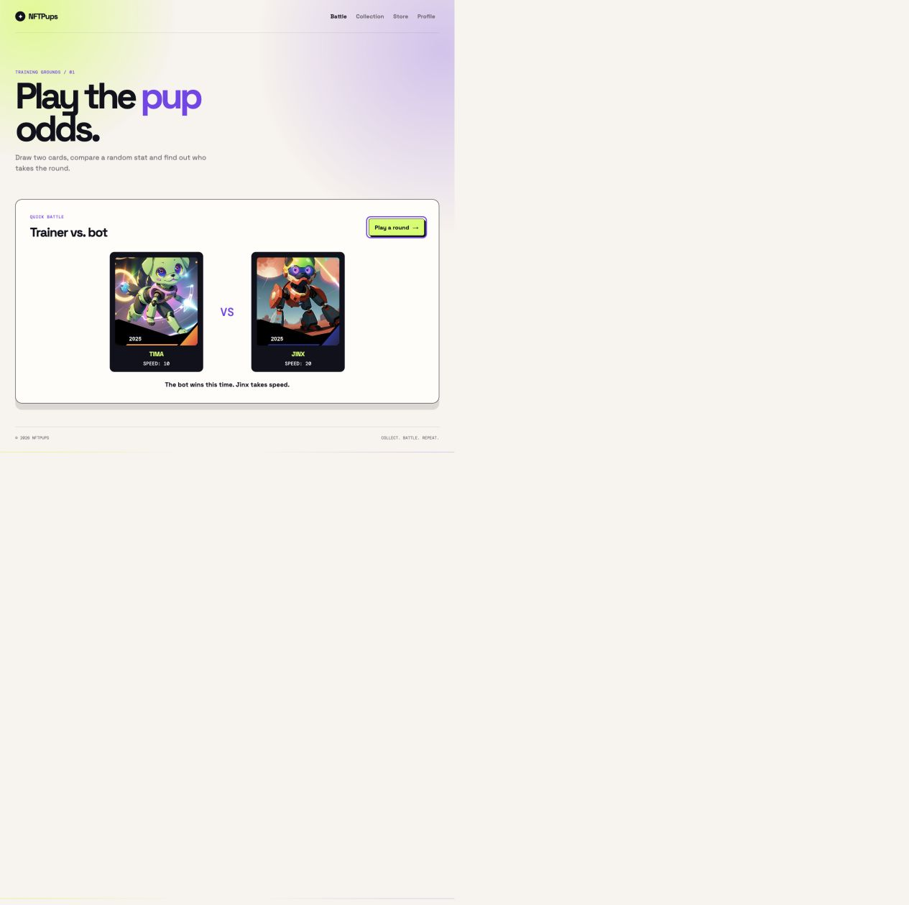
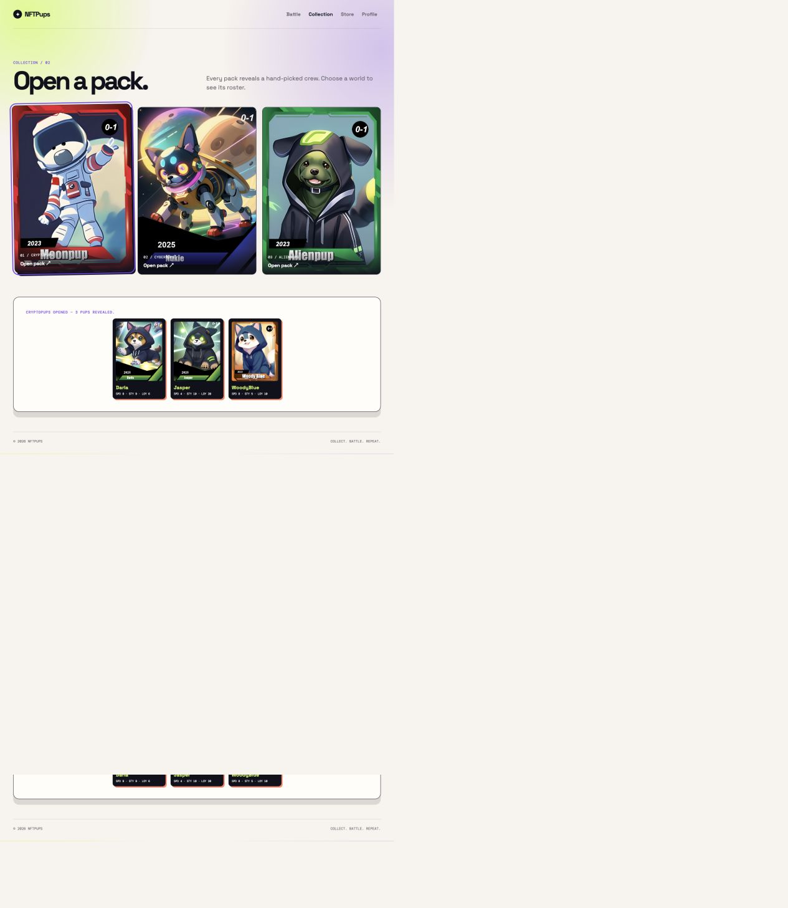
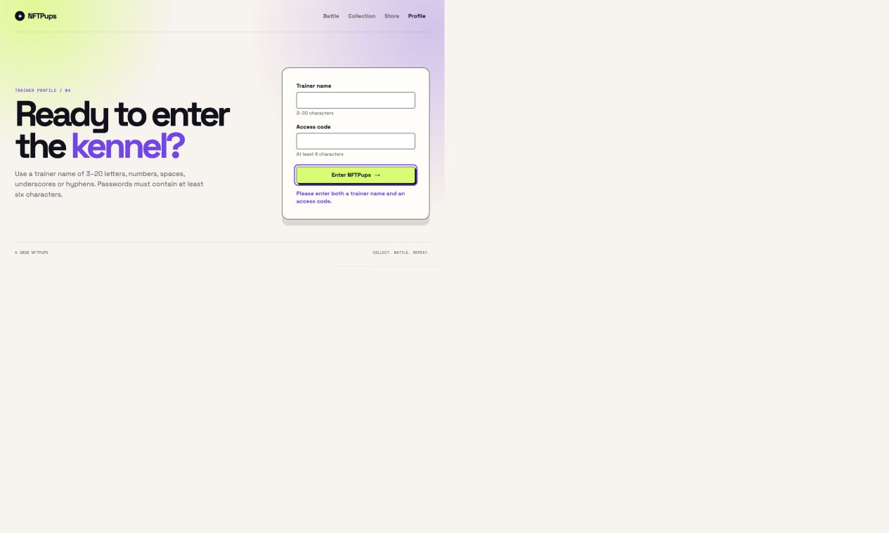
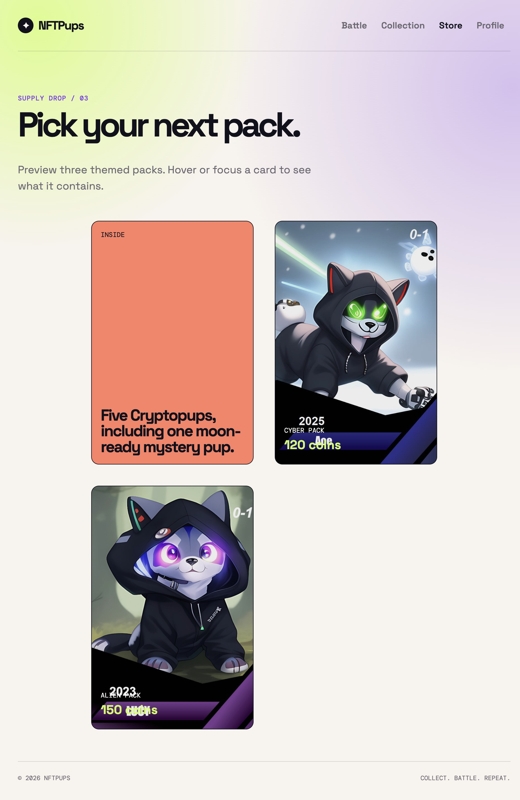
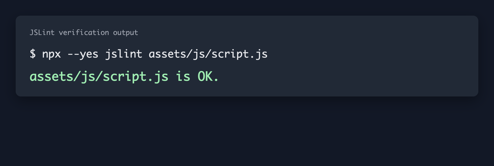
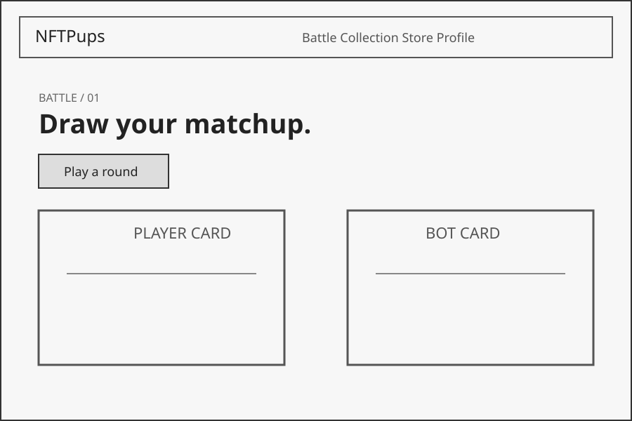
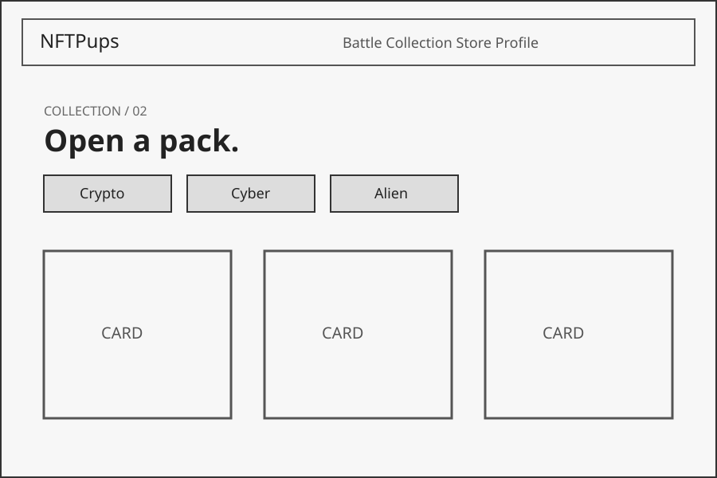
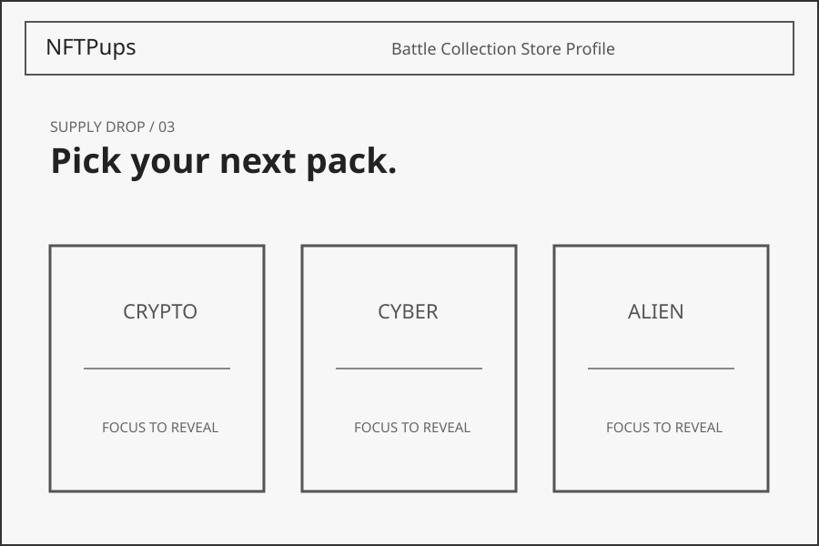
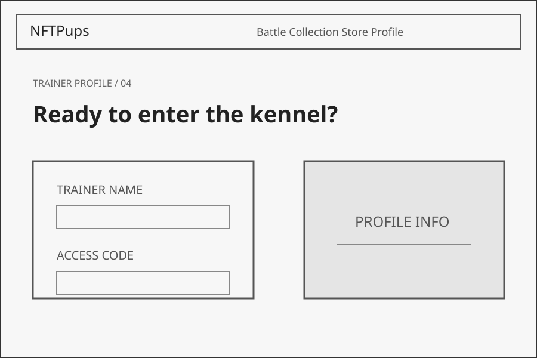
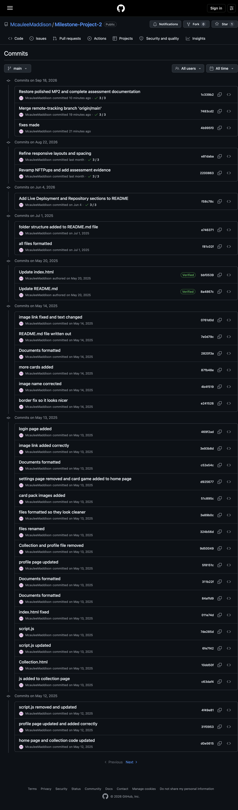

# NFTPups

NFTPups is a responsive single-page trading-card experience. Players can draw a battle round, open themed card packs and enter a trainer name to receive feedback from the profile form.

[View the live project](https://mcauleemaddison.github.io/Milestone-Project-2/) · [View the repository](https://github.com/McauleeMaddison/Milestone-Project-2)

## User stories and finished evidence

| User story | Delivered behaviour | Evidence |
| --- | --- | --- |
| As a player, I want to play a mini card game against the computer so I can test my luck. | **Play a round** selects valid player and bot cards, compares a random stat and announces win, loss or draw. |  |
| As a collector, I want to open card packs and see the cards revealed so I can enjoy the collectible experience. | Selecting a Crypto, Cyber or Alien pack clears the previous reveal and displays the valid cards from that collection. |  |
| As a trainer, I want clear feedback when I sign in so I know how to correct my details. | The form explains empty, malformed and too-short input rather than pretending that sign-in succeeded. |  |
| As a collector, I want to preview available packs before choosing one so I can understand what each pack contains. | The Store displays Crypto, Cyber and Alien pack previews. Hovering over or keyboard-focusing a pack flips the card to reveal information about its contents. |  |

## Features

- Accessible button-based navigation between Battle, Collection, Store and Profile views.
- Random battle rounds with clear card names, selected stat values and outcome messages.
- Themed pack reveal with stat summaries for every displayed card.
- Keyboard-visible focus states, skip link, labelled inputs, alt text and live status messages.
- Responsive card grid and reduced-motion support.

## Input validation and error handling

The JavaScript anticipates incomplete or invalid state instead of assuming all data is present.

- `validateLogin()` trims the trainer name and rejects empty fields, names outside the permitted 3–20-character format, and access codes below six characters. The message explains the exact correction required.
- `isValidCard()` checks every card before it can be shown. If a selected pack has no valid cards, the collection reports the problem without attempting to render broken content.
- Random selection returns `null` for an empty/non-array deck, and battle rendering checks its target elements and selected stat before changing the page. A recoverable status message is shown if data is unavailable.
- DOM lookups are checked before event listeners or content updates are used, preventing an absent element from causing an unhandled runtime error.

## Code quality and validation

The project uses semantic HTML5, valid CSS syntax, and unobtrusive JavaScript event listeners rather than inline event attributes. User-provided text is inserted using `textContent`, avoiding HTML injection through the sign-in feedback.

Run the markup, CSS and JavaScript checks from the project root:

```bash
npx --yes html-validate index.html
npx --yes stylelint assets/css/style.css
node --check assets/js/script.js
npx --yes jslint assets/js/script.js
```

At the time of this update, all four validation commands pass.

### JSLint validation evidence

JSLint was run against the project's JavaScript file from the project root.



## Design

NFTPups uses a high-contrast trading-card visual style designed to make the interactive elements easy to identify while retaining the feel of a digital collectible-card game. The interface combines a light background with strong purple, lime, coral and dark accents so that buttons, cards, status messages and navigation states remain visually distinct.

The project uses Space Grotesk for the main interface and headings, with DM Mono used for smaller labels and card-style metadata. The layout is organised as a responsive single-page application with four main sections: Battle, Collection, Store and Profile.

On larger displays, content can use multi-column card layouts, while tablet and mobile breakpoints reduce the number of columns and stack content vertically where necessary.

Navigation is kept consistent across all four sections so users can move between features without leaving the page. Interactive elements use clear focus states, responsive sizing and reduced-motion support to improve usability across different screen sizes and input methods.

### Wireframes / Mockups

The following wireframes document the intended structure of the four main sections of the finished application.

#### Battle



The Battle wireframe shows the introductory content, battle controls and player-versus-computer card area.

#### Collection



The Collection wireframe shows the themed pack selector and card reveal area.

#### Store



The Store wireframe shows the three interactive pack-preview cards.

#### Profile



The Profile wireframe shows the trainer introduction and sign-in form.

## Testing approach

Automated and manual testing have different strengths, so both are useful.

**Automated testing** runs repeatable checks quickly and consistently. It is best for rules that must remain true after every change: syntax/linting, input-validation branches, DOM rendering assertions and regression checks. It gives rapid feedback in continuous integration and makes routine coverage inexpensive, but it cannot judge whether a layout feels clear, visually balanced or intuitive.

**Manual testing** is exploratory and human-centred. It is most useful for visual hierarchy, responsive layouts, animation, keyboard flow, wording and real user journeys. A tester can spot confusing feedback or a card layout that technically renders but does not feel usable. Its limits are speed and repeatability, so manual checks should be documented and paired with automated checks for critical behaviour.

### Manual browser test record

| Test | Method | Expected result | Result |
| --- | --- | --- | --- |
| Battle round | Select **Play a round** | Two valid cards, a chosen stat and an outcome message appear. | Pass |
| Pack reveal | Open the Cryptopups pack | Only Cryptopups are shown and the status states how many were revealed. | Pass — 3 cards revealed |
| Empty profile submission | Submit the Profile form with both fields blank | A useful correction message appears; no sign-in success is shown. | Pass |
| Valid profile input | Submit `Trainer_7` and a six-character dummy access code | A personalised welcome message appears and the access field is cleared. | Pass |
| Browser errors | Inspect the browser console after the above journeys | No JavaScript errors are recorded. | Pass — 0 errors |
| Store card keyboard interaction | Open the Store and use `Tab` to focus each pack preview without using the mouse. | Each focused Store card receives a visible focus indicator and flips to reveal its contents. | Pass |

### Device Testing

| Device category | Test | Result |
| --- | --- | --- |
| Desktop | Tested navigation, Battle, Collection, Store and Profile at desktop width. | Pass |
| Tablet | Tested the responsive layout and interactive features at tablet width. | Pass |
| Mobile | Tested the single-column responsive layout, navigation and interactive features at mobile width. | Pass |

### Browser Compatibility

| Browser | Test | Result |
| --- | --- | --- |
| Google Chrome | Navigation, Battle, Collection, Store, Profile and responsive layout tested. | Unavailable in environment |
| Mozilla Firefox | Navigation, Battle, Collection, Store, Profile and responsive layout tested. | Unavailable in environment |
| Safari | Navigation, Battle, Collection, Store, Profile and responsive layout tested. | Manual test required |
| Microsoft Edge | Navigation, Battle, Collection, Store, Profile and responsive layout tested. | Unavailable in environment |

## Technologies

- HTML5
- CSS3 (Grid, Flexbox, custom properties, animation and media queries)
- Vanilla JavaScript
- Git and GitHub Pages

## Version control

Git and GitHub were used throughout development to track changes to the project. Commits provide a history of the implementation, fixes and documentation improvements made during development.



## Project structure

```text
.
├── index.html
├── README.md
└── assets
    ├── css/style.css
    ├── js/script.js
    └── images
        ├── alienpack/
        ├── cryptopack/
        ├── cyberpack/
        ├── screenshots/
        └── wireframes/
```
